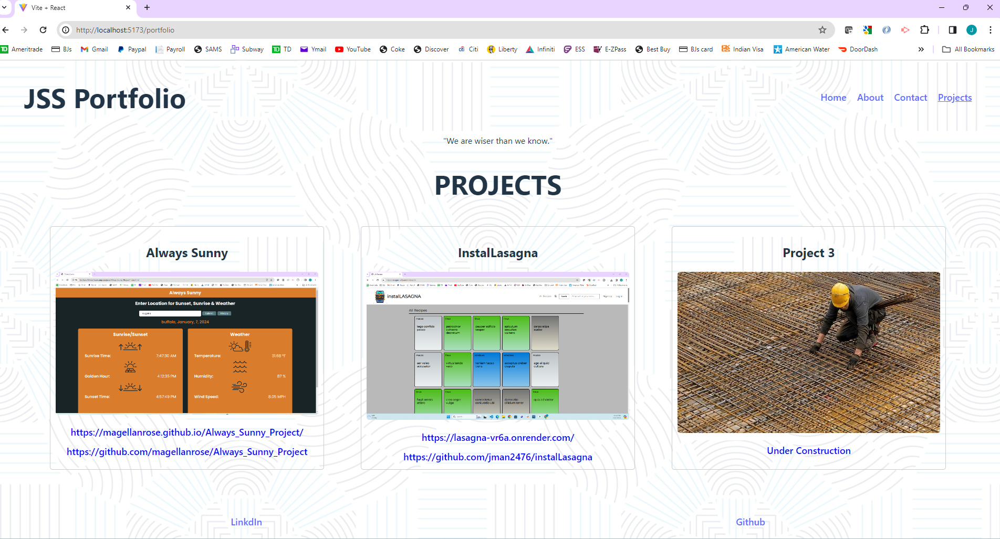

# Portfolio

## User Story

```md
As a fresh graduate of the bootcamp I am trying to showcase the skills i have learnt by
building a single-page application. This is a deployed React Portfolio of work samples
so that I can show off some of the work I have done during my course and consider me for
an open position
```

## Description

```md
This is a single-page application portfolio for a web developer and when I load the portfolio I am presented with a page containing a header, a section for content, and a footer. WhenN I click on a navigation title the browser URL changes and I am presented with the corresponding section below the navigation and that title is highlighted. When I load the portfolio the first time the Home title and section are selected by default.
WHEN I am presented with the About Me section. When I am presented with the Projects section I see titled images of the developer’s applications with links to both the deployed applications and the corresponding GitHub repositories. When I am presented with the Contact section I see a contact form with fields for a name, an email address, and a message. When I view the footer I am presented with text links to the developer’s GitHub and LinkedIn profiles, and their profile.
```

## Repository
```md
https://github.com/jsaini1727/Portfolio

```
## Deployment Link
```md
https://willowy-marigold-901a82.netlify.app


```

##Screenshot
```md

```


